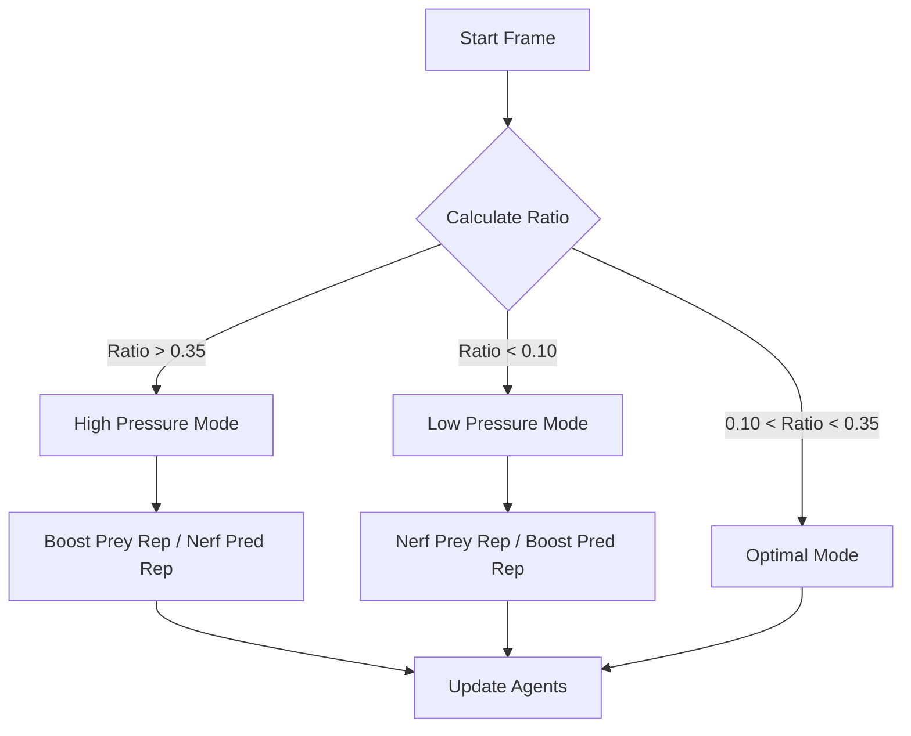

# SY-01 Simulation Study Report

**Project:** SY-01 Prey vs. Predator Simulation  
**Version:** 1.1  
**Author:** PAX RED  
**Last Updated:** 2026-01-01

---

## 1. Overview
SY-01 is a minimal scientific simulation exploring emergent behavior in a complex ecological system. The simulation models the interaction between two agent types: **Prey** and **Predators**, in a closed environment. It is designed to demonstrate how simple, local rules can lead to complex global behaviors, including population cycles, extinction events, and spontaneous recovery.

## 2. Core Mechanics

### 2.1 Agents
The simulation consists of two distinct agent classes, each with its own DNA (genetic traits) and behaviors.

#### **Prey**
*   **Behavior:** Flocking and fleeing. Prey agents actively avoid predators within their `sense` radius.
*   **Reproduction:** Asexual reproduction.
    *   **Logic:** Dynamic birth rate influenced by predator pressure (see *Dynamic Balancing*).
    *   **Genetics:** Offspring inherit speed, size, and sense radius from the parent with slight mutations (`Config.sim.mutationRate`).
*   **Metabolism:** Uses stamina to burst-flee from predators. Stamina regenerates when idle.
*   **Lifespan:** Natural death occurs after a randomized lifespan.

#### **Predator**
*   **Behavior:** Hunting and wandering. Predators chase the closest prey within their `sense` radius.
*   **Visuals:** Distinct Pink/Red coloration for high visibility.
*   **Reproduction:** Sexual-mimic reproduction (based on hunting success).
    *   **Logic:** Successful hunts increase reproduction chance. Consuming multiple prey in a short window ("Kill Streak") significantly boosts reproduction probability.
*   **Metabolism:** Uses stamina to sprint towards prey. Requires regular meals to avoid starvation.
*   **Lifespan:** Dies from starvation or old age.

### 2.2 Environmental Physics
*   **Movement:** Physics-based movement using velocity and acceleration vectors (steering behaviors).
*   **Obstacles:** Physical barriers that agents must navigate around. Agents use repulsion forces to avoid collision, adding spatial complexity to the environment.
*   **Optimization:** Spatial calculations utilize squared-distance checks to minimize CPU overhead on large populations.
*   **Boundaries:** The world is a closed 2D plane. Agents bounce off edges.
*   **Time:** The simulation runs in real-time, tracked in seconds.
*   **Initialization:** Start populations are randomized (Min/Max ranges defined in Config) to ensure unique initial conditions for every session.

## 3. Advanced Features & Emergent Logic

### 3.1 Dynamic Balancing (Feedback Loops)
To prolong the simulation and prevent early stagnation, the system employs sophisticated negative feedback loops based on **Population Ratios**:

#### **Ecosystem Ratio Logic**
The system constantly monitors the ratio of Predators to Prey (`PredatorCount / PreyCount`).
*   **Optimal Ratio:** ~0.2 (1 Predator per 5 Prey).
*   **High Ratio (>0.35):** "Competition Phase". Too many predators.
    *   *Effect:* Predator reproduction is nerfed (Competition). Prey reproduction is boosted (Panic Breeding).
*   **Low Ratio (<0.10):** "Abundance Phase". Too few predators.
    *   *Effect:* Predator reproduction is boosted (Abundance). Prey reproduction is slightly relaxed to prevent unchecked explosions.

#### **Dependency & Scarcity Protocols**
To enforce realistic ecosystem constraints, strict dependency rules are applied:
*   **Prey Dependency:** Prey lose the ability to reproduce if the predator population drops too low (< 20% of Prey). This simulates "Evolutionary Pressure" – without threats, the system deems evolution unnecessary and halts it.
*   **Predator Scarcity Response:** If prey become scarce (< 60% of Predators), predators voluntarily **stop hunting** and switch to a low-energy wandering state. This "Conservation" behavior prevents them from wiping out their food source entirely.

### 3.2 Evolutionary Mechanics & Genetic Memory
*   **Mechanism:** Every reproduction event applies a mutation variance to the child's DNA.
*   **Traits Affected:** Speed, Size, Sense Radius.
*   **Result:** Over time, agents may evolve to be faster or more perceptive, creating an evolutionary arms race.
*   **Genetic Memory (Population Learning):** While individual agents do not possess neural networks for lifetime learning, the **population** effectively "learns" survival strategies over generations.
    *   *Survival of the Fittest:* Agents that "accidentally" possess better traits (e.g., higher speed to dodge hunts) survive longer and reproduce more.
    *   *Inheritance:* These successful traits are passed down, meaning the "memory" of how to survive is encoded in the species' genome. A Gen 20 agent is significantly more adept at survival than a Gen 0 agent.

#### **Visual Evolution Tiers**
Agents change color as they evolve through generations to visualize this genetic progress:
*   **Prey:**
    *   Gen 0-2: **Green** (Base)
    *   Gen 3-5: **Cyan** (Evolved)
    *   Gen 6+: **Deep Cyan/Blue** (Advanced)
*   **Predator:**
    *   Gen 0-2: **Pink** (Base)
    *   Gen 3-5: **Red** (Evolved)
    *   Gen 6+: **Deep Red/Purple** (Advanced)

## 4. Interaction Model & User Samples

### 4.1 Limited Sampling ("Samples")
Unlike traditional "god-mode" simulations, user intervention is limited to simulate finite resources or "agent samples."
*   **Agent Samples:** The user is allocated a randomized finite number of Prey and Predator samples at the start, defined in `Config.js`.
*   **Population vs. Samples:** The initial ecosystem population is separate from user samples. The simulation starts with a thriving population (e.g., ~90 prey) while the user holds a separate reserve of samples (e.g., ~30) to influence the system later.
*   **Exhaustion:** Once samples are depleted, a non-invasive warning banner ("OUT OF AGENT SAMPLES") momentarily appears. This limits external interference, forcing the user to observe the system's natural evolution.

### 4.2 Input Logic
*   **Tap (Click & Release):** Spawns **Prey** (consumes 1 Prey Sample).
*   **Hold (Press > 0.6s):** Immediately spawns **Predator** (consumes 1 Predator Sample) if held longer than the threshold.
*   **Key Combo (A + Click):** Instantly spawns **Predator** (alternative to Hold).
    *   *Note:* User-spawned agents automatically adopt the genetics of the current global generation.

## 5. Technical Implementation Details

### 5.1 System Flow
The simulation operates on a standard Game Loop architecture.

### 5.2 Audio System (SoundManager.js)
*   **Dynamic Mixing:** Music and SFX levels are independently adjustable via `Config.js`, with support for individual volume boosts per effect type.
*   **Asset Architecture:**
    *   **Generative Music:** Two primary tracks (`soundtrack.ogg`, `outro.ogg`) with 2.0s linear cross-fading.
    *   **Interaction SFX:** 8 randomized spawn variants (`s1`-`s8`), 4 feeding variants (`nomnom1`-`nomnom4`), and dedicated cues for `kill`, `despawn`, `click`, and `tap`.
*   **Audio Optimization (Dynamic Throttling):** To maintain performance and prevent audio dropout during high-activity events:
    *   **Global Voice Limit:** Hard cap of **12 concurrent voices** across all sound types to prevent engine overload.
    *   **Dynamic Performance Scaling:** The system monitors `frameRate()` and population size in real-time.
    *   **Throttling Modes:** 
        *   *Normal:* 3 sounds per type, 200ms window.
        *   *Mild Throttling (< 45 FPS):* 2 sounds per type, 400ms window.
        *   *Heavy Throttling (< 30 FPS or > 400 Agents):* 1 sound per type, 600ms window.
    *   **Feeding Limit:** Feeding sounds (`nomnom`) are strictly disabled when total population exceeds the defined threshold (default: **50**) to reduce auditory clutter.
*   **Visual Feedback:**
    *   **Kill Flash:** A subtle red screen flash occurs when manually removing agents to provide tactile feedback.
    *   **Warning System:** Non-invasive text notifications appear for critical system states (e.g., "OUT OF SAMPLES", "AUDIO DENSITY: FEEDING MUTED").
*   **Contextual Audio:** The `despawn` sound is dynamically suppressed when the total population exceeds a defined threshold (default: 15 agents) to maintain acoustic clarity in dense environments.

### 5.3 UI/UX (UIManager.js)
*   **Design System:** Mnimalist aesthetic.
*   **Stats Card:** Real-time tracking of Populations, Available Samples, Generation Count, and Mutation Index.
*   **Visual Indicators:** Multi-colored population dots representing the current generation mix (Base/Evolved/Advanced).

---

## 6. Exploratory Directions and Ideas

The following ideas reflect directions that feel interesting to explore further based on observed system behavior. They are not implemented in the current public release and are shared as open-ended extensions without planned execution or validated outcomes.

1. **Rare Prey Variant With Predator Injury**
A possible extension is a rare prey phenotype that can injure a predator during a hunt attempt. When the predator reaches attack range, the prey triggers an injury event on the predator and escapes successfully. The predator enters an injured state with a survival timer. If the injured predator fails to secure a successful hunt within a defined timeframe, it dies. Any successful hunt within the window clears the injury state and resets survival back to normal.

This introduces a rare prey that can kill predators indirectly, which may shift selection pressure toward different hunting patterns, prey targeting behavior, and population stability.

2. **Stronger Reproductive Interdependence**
Another direction is making prey and predator birth rate logic more mutually dependent across time, using gradual pressure accumulation instead of a fast ratio correction. This could shape longer population cycles and make stability more sensitive to sustained imbalance.

~~3. **Collidable Obstacles and Avoidance Behavior**
Introducing static obstacles could reshape pathing and pursuit efficiency. Agents could gain simple avoidance behavior and the system could be observed for emergent corridor use, choke points, and spatial clustering dynamics.~~

4. **Extended Mutation and Rarity Controls**
Add trait rarity controls so that certain phenotypes emerge only after a generation threshold and with low probability. This can create phase shifts in the ecosystem where new behaviors appear later and change the equilibrium.

---

*This document captures the internal logic and design decisions of the current public release.*
